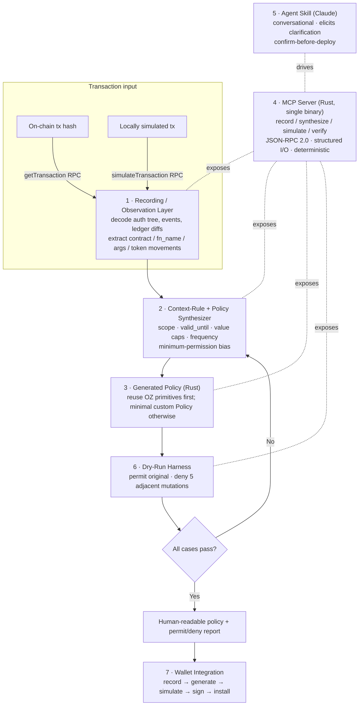

Source: https://gist.github.com/revitteth/191331235c2f68ba307941cbf8060867

# OpenZeppelin Accounts Policy Builder — Technical Architecture

**A "record-and-generate" toolkit for OpenZeppelin Stellar smart-account policies**

Applicant: **Gateway.fm AS** (Stavanger, Norway) · SCF #44, Build Award — RFP Track
Licence: Apache-2.0 (code) + CC-BY-4.0 (docs) · Target: **Protocol 26 "Yardstick"**

> This document is the technical architecture for Gateway's SCF #44 RFP-Track submission to the *OZ Accounts Policy Builder* RFP. It is Stellar/Soroban-specific throughout: every component reads the Soroban authorization model, consumes OpenZeppelin's `stellar-accounts` framework, and produces Soroban `Policy` contracts.

---

## 1. The problem

OpenZeppelin's Stellar smart-account framework (the `stellar-accounts` crate) gives Soroban genuine programmable authorization — context rules, delegated/external signers, and composable `Policy` contracts. But **authoring a custom policy means writing and auditing a full Soroban contract that implements the `Policy` trait with correct storage segregation.** That bar is prohibitive for most developers and impossible for end users, so the delegation infrastructure goes largely unused.

The unlock is the **record-and-generate** model: a user (or agent) starts from a transaction they *have already performed*, and the toolkit auto-generates a **tightly scoped, minimum-permission** policy that permits exactly that operation and denies everything else. It emits **human-readable, reviewable Rust**, proves the policy with a permit/deny dry-run report, and **never deploys automatically** — code-first, deploy-second.

---

## 2. What we generate (the target)

A generated policy is a Soroban contract implementing OpenZeppelin's `Policy` trait:

```rust
pub trait Policy {
    type AccountParams: FromVal<Env, Val>;
    fn enforce(e: &Env, context: Context, authenticated_signers: Vec<Signer>,
               context_rule: ContextRule, smart_account: Address);
    fn install(e: &Env, install_params: Self::AccountParams,
               context_rule: ContextRule, smart_account: Address);
    fn uninstall(e: &Env, context_rule: ContextRule, smart_account: Address);
}
```

`enforce()` inspects the Soroban authorization context and **panics to reject**. The decisive primitive is:

```rust
soroban_sdk::auth::Context::Contract(ContractContext { contract, fn_name, args })
```

which corresponds 1:1 to a `require_auth_for_args` call. A scoped policy reads `contract`, `fn_name`, and `args` and asserts they match the observed shape — anything else reverts. Stateful policies namespace storage by **both** the smart-account `Address` **and** the `context_rule_id` (the storage-segregation requirement the RFP calls out).

### Differentiator — function/argument-level scoping

OpenZeppelin's own docs flag that a `CallContext` (`CallContract`) context rule grants **full contract-level access** — threshold-only policies that don't inspect `Context` cannot scope per function. Our generated policies **always** assert `fn_name` and the relevant `args`, so a grant is bounded to exactly the observed call. This is the concrete gap contract-level / threshold-only policies can't close.

---

## 3. System architecture — the seven-component pipeline



| # | Component | Stellar/Soroban role |
|---|---|---|
| 1 | **Recording / observation layer** | Ingests a real on-chain tx by hash via `getTransaction` (decodes `resultMetaXdr`, contract events, diagnostic events) or a locally simulated tx via `simulateTransaction`. Extracts the invoked `(contract, fn_name, args)` from the `SorobanAuthorizationEntry` root + sub-invocations, plus token movements from SAC/SEP-41 `transfer`/`mint`/`burn` events and before/after `LedgerEntry` diffs. |
| 2 | **Context-rule + policy synthesizer** | Converts recorded tx(s) into a proposed **context rule** (which contracts/functions; `valid_until` ledger and/or per-policy deadline) plus the **minimal** OZ policy set. Minimum-permission by default: only the exact observed shape passes; amounts/frequency derived from observation with no upward rounding; short default lifetimes. |
| 3 | **Generated Rust policy** | A compilable Soroban contract (`soroban-sdk`, `stellar-accounts` dependency) per §4. |
| 4 | **MCP server (Rust)** | One binary embedding the synthesizer + harness — no cross-language IPC. Exposes `record` / `synthesize` / `simulate` / `verify` as MCP tools over JSON-RPC 2.0 (stdio for local, Streamable HTTP for the hosted endpoint), JSON-Schema-typed I/O, **deterministic** (same input + version → same policy bytes and verdicts), machine-readable error codes. Uses MCP **elicitation** to require explicit human confirmation before any state-changing step. The LLM only *calls* these tools — it never decides the policy bytes. |
| 5 | **Agent skill (Claude)** | Wraps the MCP behind a conversational interface ("grant permission to do X; here is a tx I performed; draft a policy"). Explicitly instructed *when to ask for clarification* (ambiguous lifetime, multiple plausible scopes, unrecognised contract) rather than guessing; elicits confirmation before any state change. |
| 6 | **Dry-run harness** | See §5. |
| 7 | **Wallet integration** | End-to-end: record → generate → simulate → sign → install on a real smart account. |

---

## 4. Reuse-first synthesis (safety through audited primitives)

The synthesizer biases hard toward OpenZeppelin's **already-audited** policy primitives and emits net-new Rust only where they cannot express the constraint. This minimises the surface of *generated* (and therefore newly-auditable) code — directly answering the RFP's concern that the tool emits authorization logic running on user funds.

| Observed pattern | Generated policy |
|---|---|
| Token transfer with a **value cap** | Install OZ **`spending_limit`** with derived `SpendingLimitAccountParams { spending_limit, period_ledgers }` — it already matches `fn_name == "transfer"`, reads the amount at `args[2]`, evicts entries older than `current_ledger − period_ledgers`, and panics `SpendingLimitExceeded`. **No generated Rust needed.** |
| **N-of-M / weighted** approval | Install OZ **`simple_threshold`** / **`weighted_threshold`** with derived params. |
| **Function + argument scoping** (specific contract, fn, recipient, path, deadline) and **call-count caps** (no OZ primitive exists) | Emit a **minimal custom `Policy`** that asserts `context.contract`, `context.fn_name` and named arg constraints, deferring value caps to a composed `spending_limit`. |

A greenfield rewrite is **not** proposed. OZ primitives are reused, not replaced.

---

## 5. The dry-run harness (where trust is earned)

For every generated policy, in `soroban-sdk` test environments and via `simulateTransaction`:

- **Permit case** — replay the original recorded invocation against a smart account with the new context rule + policy installed → `enforce()` must **not** panic.
- **Deny cases** (auto-generated by mutating one dimension each), all of which must revert:
  - (a) different asset / contract,
  - (b) larger amount (`args[2]` > limit → `SpendingLimitExceeded`),
  - (c) out-of-window timing (past `valid_until` / period),
  - (d) different function (`fn_name` mismatch),
  - (e) different recipient (`to` arg mismatch).

Policy state mutations are confirmed via the simulation's before/after `LedgerEntry` diffs. Because the synthesizer and harness are deterministic, any reviewer reproduces the same policy and the same permit/deny verdicts.

---

## 6. Three documented end-to-end walkthroughs

1. **Blend yield-claim** — permit only `claim(from, reserve_token_ids, to)` on a specific Blend pool `Address`, with `from`/`to` = the smart account and a fixed `reserve_token_ids` set; denies `submit`/borrow/withdraw entirely.
2. **SEP-41 subscription / recurring billing** — permit a merchant to pull a fixed amount on a fixed cadence: scope to the token's `transfer`/`transfer_from`, fixed `to` = merchant, `amount ≤` recorded amount, plus a frequency cap (one charge per N ledgers) via `spending_limit`'s rolling window sized so one charge fills the window.
3. **Bounded Soroswap delegation** — permit only `swap_exact_tokens_for_tokens` on the router, restrict `path` to a whitelisted token pair, cap `amount_in`, force `to` = smart account, bound by `deadline` / `valid_until`.

---

## 7. Decentralization, infrastructure & privacy

**Decentralization.** The trust-bearing artefacts are the **generated Rust policy and its dry-run report** — fully reviewable, reproducible and verifiable by anyone from the recorded transaction. The synthesizer and harness are deterministic: same input tx + same tool version → same policy and same verdicts. Deployment is never automatic — it is done by the user's own wallet signing their own smart account. The MCP server is **self-hostable** (open source), so no Gateway-operated instance is a required dependency.

**Infrastructure.** The reference MCP endpoint runs on Gateway's carbon-neutral, multi-region infrastructure (the same operational base as our public Soroban RPC). It is **stateless per request — no custody, no keys**, horizontally scalable, pinned to a published, versioned MCP schema. The Rust synthesizer and harness run locally for any developer who prefers not to use the hosted endpoint.

**Privacy.** The tool processes **public on-chain transactions** and locally simulated transactions. **No secret keys ever touch Gateway infrastructure** — signing is client-side, by the user's own wallet. The hosted endpoint logs only coarse, non-identifying operational metrics (request counts, latency, error codes) and does not persist transaction contents, account identifiers, or generated policies beyond the request lifecycle unless the user explicitly opts into a saved-session feature. Self-hosting removes Gateway from the data path entirely.

---

## 8. Prior art — adopt / extend / replace

| Prior work | Decision | Rationale |
|---|---|---|
| **`kalepail/pollywallet`** (the RFP's named MVP) | **Adopt + extend** | Demonstrates the passkey → OZ smart-account deploy/sign flow on testnet, but its README lists *transaction policy recording/generation* as **not implemented** — precisely our core contribution. We reuse its passkey + smart-account scaffolding. |
| **`smart-account-kit`** | **Adopt as install layer** | Deploy/manage OZ smart accounts with policy types as parameters — our install/sign substrate. |
| **`passkey-kit` + `launchtube`** | **Adopt for the wallet demo** | Passkey signing + hosted submission/paymaster make the end-to-end "sign → install" demo feeless and realistic. |
| **OZ `stellar-accounts` primitives** | **Reuse, do not replace** | `spending_limit`, `simple_threshold`, `weighted_threshold` are audited; we generate against them first. |

---

## 9. Stellar tech stack (most recent stable; reconfirm at submission)

- **Network:** Protocol 26 "Yardstick".
- **Contracts / synthesizer:** Rust, `soroban-sdk 26.1.0`, `stellar-accounts 0.7.2`, target `wasm32v1-none`, built with `stellar-cli 26.1.0` (`stellar contract build --optimize`).
- **MCP server:** Rust (Rust MCP SDK), JSON-RPC 2.0, stdio + Streamable HTTP, versioned schema.
- **Recording:** Soroban RPC (`getTransaction`, `simulateTransaction`) + XDR decoding.
- **Agent skill:** packaged Claude skill over the MCP tools.
- **Wallet:** `smart-account-kit` / `passkey-kit` + `launchtube`, testnet → mainnet.

---

## 10. Security posture (summary)

- **Reuse-first** minimises newly-auditable code (§4).
- **Deterministic, reproducible** synthesizer + harness — reviewers independently reproduce every generated policy and verdict.
- **Confirm-before-deploy / code-first** — no automatic deployment; the user reviews human-readable Rust + a dry-run report before signing.
- **STRIDE threat model** prepared for the **SCF Soroban Security Audit Bank**; documented **OpenZeppelin technical-reviewer sign-off** on generated-code quality before mainnet.

*Built in the open under Apache-2.0 from commit zero; public repos under `github.com/gateway-fm`.*
