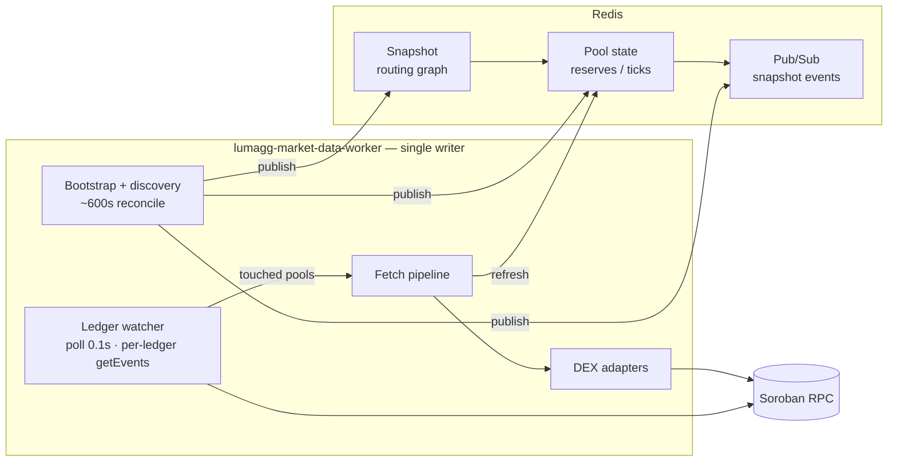
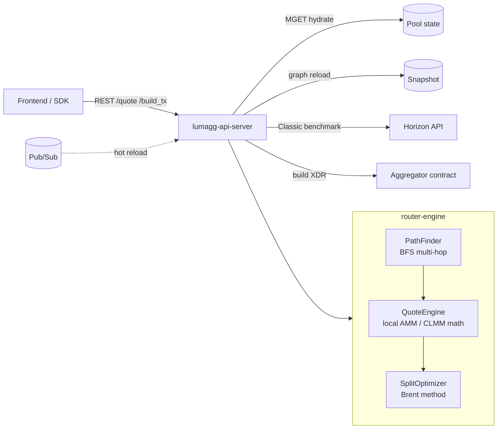
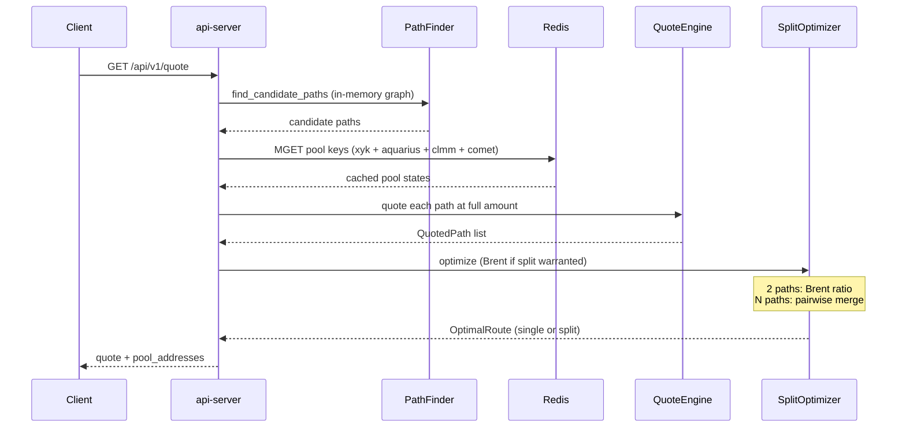
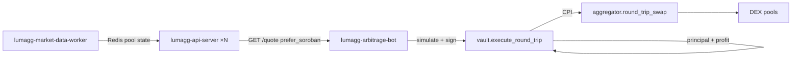

Source: https://github.com/Lum-Agg/stellar-dex-agg/blob/main/README.md (architecture section: https://github.com/Lum-Agg/stellar-dex-agg#architecture)

# Stellar DEX Aggregator (LumAgg)

[](https://github.com/Lum-Agg/stellar-dex-agg)
[](LICENSE)

Multi-source liquidity aggregation for Stellar's Soroban DEX ecosystem.

**Repository:** https://github.com/Lum-Agg/stellar-dex-agg  
**中文文档:** [README.zh-CN.md](README.zh-CN.md)

LumAgg routes swaps across **Soroswap**, **Aquarius** (xy=k, stable, CLMM), **Phoenix**, **Sushi V3**, and **Comet**, with optional comparison against **Classic DEX** (Horizon PathPayment). It supports multi-hop paths, split orders across venues, and atomic on-chain execution via an optional aggregator contract.

## Contents

- [Architecture](#architecture)
- [Arbitrage & vault](#arbitrage--vault)
- [DEX sources](#dex-sources)
- [Key features](#key-features)
- [Why not Classic DEX routing?](#why-not-classic-dex-routing)
- [Project structure](#project-structure)
- [Development](#development)
- [Deployment](#deployment)
- [Configuration](#configuration)
- [Split routing](#split-routing)
- [Related docs](#related-docs)
- [License](#license)

## Architecture

### Design principles

| Principle | Implementation |
|-----------|----------------|
| **Topology vs state** | Routing graph (pairs, pool IDs, fees) is separate from live reserves / ticks |
| **Single writer** | `lumagg-market-data-worker` owns all Redis writes; `lumagg-api-server` is stateless |
| **Event-driven freshness** | Ledger events refresh *touched* pools; no periodic full-market sweep |
| **Cold pools stay valid** | Pools with no on-chain activity keep their last Redis value until overwritten |

Pool state updates use three channels: **bootstrap** (worker start), **ledger watcher** (hot path, poll 0.1s), and **discovery** (~600s reconciliation). See [`docs/pool-state-architecture.md`](docs/pool-state-architecture.md) for details.

### System overview

Two paths share one Redis store.

**1 — Pool state writes (`lumagg-market-data-worker`)**



**2 — Quote reads (`lumagg-api-server`)**



After path discovery and Redis hydration, **QuoteEngine** quotes each candidate path locally, then **SplitOptimizer** decides whether to send the full amount down one path or split across several. For two paths it uses **Brent's method** (~10 evaluations, ~0.01% tolerance) to find the optimal input ratio; for more paths it merges pairwise (recursive Brent for 2-path merges, output-weighted seed for 3+). Splitting runs only when price impact exceeds `SPLIT_THRESHOLD_BPS` or competing paths are within `SPLIT_COMPETITIVE_DELTA_BPS`. See [Split routing](#split-routing).

**Redis keys** (pool keys use `EX=86400`):

| Key pattern | Contents |
|-------------|----------|
| `lumagg:snapshot:*` | Versioned graph + CLMM metadata (no reserves) |
| `lumagg:pool:xyk:{source}:{pool}` | xy=k reserves |
| `lumagg:pool:aquarius:{pool}` | Aquarius N-token / stable reserves |
| `lumagg:pool:comet:{pool}` | Comet weighted pool (token balances + weights + fee) |
| `lumagg:pool:clmm:{source}:{pool}` | CLMM slot0, liquidity, ticks |
| `lumagg:snapshot:events` | Pub/Sub channel for snapshot hot-reload |

### Data layers

| Layer | Contents | Storage | Update cadence |
|-------|----------|---------|----------------|
| **Graph** | Token pairs, pool addresses, fee tiers; CLMM refs (no ticks) | `lumagg:snapshot:*` | Bootstrap; discovery ~600s |
| **Pool state** | xy=k reserves; Aquarius multi-token; Comet weighted; CLMM slot0 + ticks + coverage | `lumagg:pool:*` | Ledger poll 0.1s for touched pools; bootstrap + discovery full publish |

The API does **not** keep a long-lived in-process pool cache. Each `/quote` reloads the graph from the last snapshot, then overlays pool state from Redis (`QUOTE_RPC_HYDRATE_ENABLED=false` by default).

### Quote request flow



Steps in code:

1. **Path discovery** — BFS on the routing graph; all candidate paths (no liquidity prune).
2. **Collect pool keys** — unique `(source, pool_address)` across paths.
3. **Hydrate pool state** (`pool_hydrate::hydrate_paths`) — Redis MGET for xy=k, Aquarius, CLMM, and Comet weighted state (written by worker). Optional Soroswap xy=k / Comet RPC fallback for Redis misses when `QUOTE_RPC_HYDRATE_ENABLED=true`.
4. **Per-path quote** — local AMM / CLMM / Comet math at full `amount_in`; skip CLMM hops when `coverage.is_complete` is false.
5. **Split optimization** — `SplitOptimizer`: skip if impact below threshold; else Brent's method (2-path) or pairwise merge (N-path) to maximize total output.
6. **Classic compare** — optional Horizon PathPayment benchmark vs best Soroban route.

### Ledger watcher (hot path)

Stellar Soroban RPC has no WebSocket / Geyser push — the worker **polls** `getLatestLedger` every **0.1s**, then fetches **one ledger at a time**:

```text
getLatestLedger
  → for each new ledger N:
      getEvents(N, N+1)
      → match contractId to KnownPoolIndex (pool + router event parse)
      → fetch pipeline: RPC refresh touched pools only
      → Redis SET (CLMM only if coverage.is_complete)
```

Active pools typically refresh within **~0.1–2s** after a swap / add / remove on-chain.

**CLMM policy:** tick data lives in pool contract storage. Worker writes Redis only when `coverage.is_complete`; otherwise quote engine skips those hops.

## Arbitrage & vault

Operator-facing atomic round-trip stack (not a retail product). Trading principal can sit in a **vault** so hot wallets only pay Soroban fees. Public deployment guide: [`docs/arbitrage-deployment.md`](docs/arbitrage-deployment.md). Contract detail: [`contracts/vault/README.md`](contracts/vault/README.md).

### Operator architecture



| Piece | Crate / contract | Role |
|-------|------------------|------|
| Quotes | `api-server` | Same `/quote` stack as the UI; arb sets `prefer_soroban=1`, usually `max_splits=1` |
| Scanner | `crates/arbitrage` | Bridge scan → size optimize → simulate → optional submit |
| Vault | `contracts/vault` | Allowlisted callers; holds base (e.g. XLM SAC) float |
| Aggregator | `contracts/aggregator` | `round_trip_swap` (leg_out + leg_back) |

Without `ARB_VAULT_CONTRACT`, the bot calls `aggregator.round_trip_swap` directly and callers must hold the trade float themselves.

### Vault fund flow

One host invocation (`execute_round_trip`):

```text
1. caller authorizes nested SAC approve(vault, i128::MAX, expiration_ledger)
2. vault ──amount_in──► caller
3. aggregator.round_trip_swap(user=caller, leg_out, leg_back, min_amount_out)
4. vault transfer_from(caller → vault, actual base_total)
```

- **Allowlist** — only `add_caller` addresses may execute; no public withdraw for bots.
- **Reclaim auth** — approve ceiling is `i128::MAX`; reclaim amount is **not** pinned to the simulated return (avoids `auth: invalid_action` when live ≠ sim).
- **Expiration** — `allowance_expiration_ledger` is a **call argument** from the bot (`latest_ledger + cushion`). Do **not** compute `sequence()+N` inside the vault: simulate vs inclusion drift caused mainnet `Unauthorized function call for address` on the nested `approve` (2026-07-16). See comments in `contracts/vault/src/lib.rs`.

### Bot pipeline (`crates/arbitrage`)

```text
bridges × base
  → quote-api round-robin (profit / route)
  → optional amount optimize (log-spaced samples)
  → acquire caller (round-robin pool)
  → build vault.execute_round_trip | aggregator.round_trip_swap
  → simulateTransaction + assemble auth
  → gate on simulated net profit after fees (ARB_MIN_PROFIT)
  → sign + send (ARB_SUBMIT_TX=1); optional getTransaction poll
```

| Concern | Behavior |
|---------|----------|
| Callers | Mnemonic indices or secrets; mutex + cooldown ~1 ledger after send |
| Dedup | Skip same path within `ARB_SUBMIT_DEDUP_SECS` |
| Safety | Default unit has `ARB_SUBMIT_TX=0`; enable via `deploy/arb.env` |
| Monitoring | `journalctl -u lumagg-arb`; optional Telegram P&amp;L |

### Deploy arb

Build and install `lumagg-arbitrage-bot` as a separate native service. Follow the
[public deployment guide](docs/arbitrage-deployment.md), which starts in
quote-only mode and requires an explicit staged rollout before live submission.

| Unit | Role |
|------|------|
| `lumagg-arb.service` | Round-trip scanner (depends on Redis + quote APIs) |

## DEX sources

| Source | Pool type | In routing graph | Pool state in Redis | Quote math |
|--------|-----------|------------------|---------------------|------------|
| **soroswap** | xy=k | Yes | Discovery + ledger | Constant product |
| **aquarius** | xy=k + stable | Yes | Discovery + ledger | xy=k / stable |
| **phoenix** | xy=k | Yes | Discovery + ledger | Fee-on-output |
| **sushi** | CLMM V3 | Yes | Discovery + ledger | Local `clmm_math` |
| **aquarius_clmm** | CLMM | Yes | Discovery + ledger | Local `clmm_math` |
| **comet** | Weighted | Yes | Discovery + ledger (`lumagg:pool:comet:*`) | Balancer math |
| **classic_dex** | Native orderbook | **No** | **Per quote** (Horizon) | Benchmark only |

## Key features

- **Multi-source aggregation** across six Soroban DEX families
- **Multi-hop routing** — BFS through intermediate tokens (configurable max hops)
- **Split orders** — Brent optimizer across paths when impact or competitiveness warrants it
- **Event-driven pool state** — ledger watcher + discovery; no periodic full sweep
- **Horizontally scalable API** — stateless `lumagg-api-server` instances behind a load balancer
- **Sub-2s hot pool freshness** — 0.1s ledger poll + fetch pipeline for touched pools
- **Atomic on-chain execution** — optional aggregator contract (`split_swap`, `round_trip_swap`)
- **Atomic arb operator stack** — vault-pooled capital + `lumagg-arbitrage-bot` round-trips (see [Arbitrage & vault](#arbitrage--vault))
- **Classic benchmark** — Horizon PathPayment per quote without polluting the Soroban graph

## Why not Classic DEX routing?

Stellar's native PathPayment has **uncontrollable routing** — Stellar Core decides how to split across orderbooks and pools. You cannot force a specific pool or path.

This aggregator targets **Soroban DEXes** where each hop is a deterministic contract call. Classic DEX is a **per-quote benchmark** (and fallback for tokens only on the native DEX), not an edge in the pathfinder graph.

## Project structure

```
├── contracts/
│   ├── aggregator/             # split_swap, round_trip_swap
│   └── vault/                  # Arb float + execute_round_trip (bot allowlist)
├── crates/
│   ├── market-snapshot/        # MarketSnapshot schema, Redis pool_state_store
│   ├── market-data-worker/     # Discovery, ledger watcher, fetch pipeline
│   ├── dex-adapters/           # Per-DEX adapters, RPC, pool index, router events
│   ├── router-engine/          # PathFinder, QuoteEngine, split optimizer
│   ├── api-server/             # REST API (/quote, /build_tx, /tokens)
│   ├── arbitrage/              # Round-trip scanner (vault or direct aggregator)
│   ├── analytics-indexer/      # On-chain aggregator tx indexer (SCF analytics v0)
│   ├── lumagg-alerts/          # Telegram / monitoring alerts
│   └── sdk/                    # Client SDK
├── docs/
│   ├── pool-state-architecture.md
│   ├── aggregator-deployment.md
│   ├── arbitrage-deployment.md
│   └── analytics-indexer.md
├── packaging/                 # Public systemd and environment templates
├── thirdparty/                 # Optional local upstream clones (not tracked; see README there)
├── deploy/                     # LumAgg-operated infrastructure (not public templates)
└── frontend/                   # SvelteKit demo UI
```

## Third-party reference

Upstream DEX repos are **not** vendored in git. For contract layout / mainnet manifests when editing adapters, clone into `thirdparty/` — see [thirdparty/README.md](./thirdparty/README.md). Builds and deploy do not require it.

## Development

```bash
# Compile
cargo check --workspace --exclude aggregator-contract

# Tests
cargo test --workspace --exclude aggregator-contract

# Local file-backed stack (dev)
SNAPSHOT_DIR=data/snapshots cargo run -p market-data-worker
SNAPSHOT_DIR=data/snapshots cargo run -p api-server

# Self-host / Jupiter-like: one binary, in-process worker, memory stores (no Redis)
LUMAGG_MODE=embedded \
RPC_URL=https://mainnet.sorobanrpc.com \
LISTEN_ADDR=127.0.0.1:3100 \
cargo run -p api-server

# Public self-host distribution (same embedded architecture)
RPC_URL=https://mainnet.sorobanrpc.com cargo run -p lumagg-swap-api

# Local Redis-backed stack (production-style)
redis-server --port 6380 --save "" --appendonly no

SNAPSHOT_BACKEND=redis \
SNAPSHOT_REDIS_URL=redis://127.0.0.1:6380/ \
SNAPSHOT_REDIS_CHANNEL=lumagg:snapshot:events \
cargo run -p market-data-worker

LISTEN_ADDR=127.0.0.1:3113 \
SNAPSHOT_BACKEND=redis \
SNAPSHOT_REDIS_URL=redis://127.0.0.1:6380/ \
SNAPSHOT_REDIS_CHANNEL=lumagg:snapshot:events \
cargo run -p api-server
```

`LUMAGG_MODE=embedded` reuses the **same** worker + quote code as cluster mode; only the store backend changes (memory vs Redis). Production should keep the Redis split (`LUMAGG_MODE=cluster`, default).
**Utility binaries** (`dex-adapters`):

```bash
# Audit ledger events → touched pools (live chain)
RPC_URL=... REDIS_URL=... AUDIT_LEDGERS=30 \
  cargo run -p dex-adapters --release --bin audit-ledger-events

# Dump per-ledger events to JSONL
DUMP_DIR=./ledger-events-dump DUMP_LEDGERS=5 \
  cargo run -p dex-adapters --release --bin dump-ledger-events
```

## Deployment

Choose the topology by workload:

| Workload | Guide |
|----------|-------|
| Private quote API or integration testing | [`docs/lumagg-swap-api.md`](docs/lumagg-swap-api.md) |
| Public, scalable Aggregator | [`docs/aggregator-deployment.md`](docs/aggregator-deployment.md) |
| Independent arbitrage operator | [`docs/arbitrage-deployment.md`](docs/arbitrage-deployment.md) |

Public native systemd and environment templates live in `packaging/`. Files in
`deploy/` and the root deployment scripts describe LumAgg-operated
infrastructure and are not portable installation interfaces.

## Configuration

### Shared

| Variable | Default | Meaning |
|----------|---------|---------|
| `RPC_URL` | mainnet gateway.fm | Soroban JSON-RPC endpoint |

### Snapshot & Redis

| Variable | Default | Component | Meaning |
|----------|---------|-----------|---------|
| `SNAPSHOT_BACKEND` | — | worker, API | `file` or `redis` |
| `LUMAGG_MODE` | `cluster` | API | `cluster` = Redis + separate worker; `embedded` = one process, memory stores |
| `SNAPSHOT_REDIS_URL` | — | worker, API | Redis URL (snapshots + pool state); not required for `embedded` |
| `SNAPSHOT_REDIS_CHANNEL` | `lumagg:snapshot:events` | worker, API | Pub/Sub for snapshot hot-reload |
| `SNAPSHOT_POLL_INTERVAL_MS` | `1000` | API | Polling fallback if Pub/Sub missed |
| `POOL_STATE_TTL_SECS` | `86400` | worker | Redis EX on pool keys (eviction, not freshness SLA) |

### Worker — discovery & ledger

| Variable | Default | Meaning |
|----------|---------|---------|
| `DISCOVERY_INTERVAL_SECS` | `600` | Full graph rediscovery + Redis pool publish |
| `REFRESH_INTERVAL_SECS` | `5` | Adapter cache refresh (feeds discovery) |
| `LEDGER_WATCHER_ENABLED` | `true` | Requires Redis pool store |
| `LEDGER_POLL_SECS` | `0.1` | Ledger poll interval (min `0.1`) |
| `LEDGER_MAX_CATCHUP` | `32` | Max ledgers ingested per poll after backlog |
| `FETCH_PIPELINE_ENABLED` | `true` | Ledger touched → task queue → Redis |
| `FETCH_WORKER_COUNT` | `8` | Concurrent RPC workers in fetch pipeline |
| `POOL_STATE_REFRESH_CONCURRENCY` | `8` | Concurrent getLedgerEntries batches |

### API — quoting & routing

| Variable | Default | Meaning |
|----------|---------|---------|
| `QUOTE_RPC_HYDRATE_ENABLED` | `false` | RPC fallback on Redis miss (emergency) |
| `QUOTE_HYDRATE_MAX_POOLS` | `12` | Max xy=k RPC hydrates when enabled |
| `PATH_FINDER_MAX_HOPS` | `3` | Max hops per path |
| `PATH_FINDER_MAX_MULTI_HOP_PATHS` | `50` | Cap on 2+ hop paths per quote |
| `PATH_FINDER_MAX_DIRECT_PATHS` | `0` | Cap on 1-hop pools (`0` = all) |
| `MAX_SPLITS` | `5` | Max candidate paths for split optimization |
| `SPLIT_THRESHOLD_BPS` | `5` | Min price impact (bps) before split attempt |
| `SPLIT_COMPETITIVE_DELTA_BPS` | `50` | Also split when 2nd path is within this bps of best |
| `MIN_SPLIT_FRACTION_BPS` | `5` | Drop split legs below this output share |

### DEX discovery overrides

| Variable | Default | Meaning |
|----------|---------|---------|
| `SUSHI_DISCOVERY_RPC` | public gateway | RPC for Sushi pool probes |
| `COMET_FACTORY` | Blend mainnet factory | Comet factory contract |
| `COMET_EXTRA_POOLS` | — | Comma-separated extra Comet pool IDs |

### Arbitrage bot (see also `docs/arbitrage-deployment.md`)

| Variable | Default / notes | Meaning |
|----------|-----------------|---------|
| `ARB_AGGREGATOR_CONTRACT` | required for build | LumAgg aggregator |
| `ARB_VAULT_CONTRACT` | optional | Vault mode; unset → direct `round_trip_swap` |
| `ARB_QUOTE_API_URLS` | `http://127.0.0.1:3100,…` | Round-robin quote APIs |
| `ARB_BRIDGE_TOKENS` | SAC list | Bridge hubs for XLM↔token↔XLM |
| `ARB_BASE_TOKENS` | XLM SAC | Round-trip base |
| `ARB_MNEMONIC_PATH` + `ARB_CALLER_INDICES` | — | HD callers (fee wallets) |
| `ARB_BUILD_TX` | `0` | Build/simulate path |
| `ARB_SUBMIT_TX` | `0` | Live broadcast |
| `ARB_MIN_PROFIT` | stroops | Net profit floor after estimated fees |
| `ARB_MAX_SPLITS` | often `1` for arb | Keep routes simple / cheaper fees |
| `ARB_POLL_TX` | `0` | Background `getTransaction` for SUCCESS/FAILED stats |

## Split routing

Production `deploy/lumagg-api@.service` sets split env vars explicitly.

The **SplitOptimizer** (`crates/router-engine/src/split_optimizer.rs`) runs inside QuoteEngine after every path has been quoted at full size:

| Case | Algorithm |
|------|-----------|
| Impact &lt; `SPLIT_THRESHOLD_BPS` and paths not competitive | Single best path (no split) |
| 2 paths | **Brent's method** on `[0, 1]` to maximize `out_a(x) + out_b(1−x)` |
| 3+ paths | Pairwise recursive Brent merges; 3+ seed uses output-weighted allocation |

Brent tolerance defaults to `0.0001` (0.01%) with up to 18 iterations — similar in spirit to Jupiter Iris (golden-section + Brent).

- **`SPLIT_THRESHOLD_BPS=5` (0.05%)** — split runs when estimated impact ≥ 5 bps, or paths are competitive (within `SPLIT_COMPETITIVE_DELTA_BPS` with impact > 0).
- **`SPLIT_THRESHOLD_BPS=1` (0.01%)** — usually not worth it: more optimizer work, many quotes still return `split_rejected_reason: "no_improvement"`.
- Use `?debug=1` on `/quote` to see `split_attempted`, `split_threshold_bps`, `split_rejected_reason`, and `split_method` (e.g. `two_path_brent`).

## Related docs

| Doc | Topic |
|-----|-------|
| [`docs/integrator-guide.md`](docs/integrator-guide.md) | Partner quickstart — quote, build_tx, API keys, `prefer_soroban` |
| [`docs/openapi.yaml`](docs/openapi.yaml) | OpenAPI 3 spec for `/quote`, `/build_tx`, `/tokens`, `/health` |
| [`docs/analytics-indexer.md`](docs/analytics-indexer.md) | On-chain analytics indexer v0 — attribution spec, env, export |
| [`docs/pool-state-architecture.md`](docs/pool-state-architecture.md) | Pool state design, env tables, code pointers |
| [`docs/aggregator-deployment.md`](docs/aggregator-deployment.md) | Native worker + Redis + API production deployment |
| [`docs/arbitrage-deployment.md`](docs/arbitrage-deployment.md) | Native arbitrage bot install and staged rollout |
| [`docs/contracts-deployment.md`](docs/contracts-deployment.md) | Aggregator and Vault deployment, upgrade, and external TTL maintenance |
| [`docs/gitbook-deployment.md`](docs/gitbook-deployment.md) | Maintainer runbook for Git Sync, publishing, and custom domain setup |
| [`docs/scf-venue-comparison.md`](docs/scf-venue-comparison.md) | LumAgg vs Soroswap / Stellar Broker — venue coverage & SCF differentiation evidence |
| [`docs/scf-resubmission-budget.md`](docs/scf-resubmission-budget.md) | SCF #44 resubmission — $80k tranche deliverables (copy-paste) |
| [`docs/lumagg-swap-api.md`](docs/lumagg-swap-api.md) | Native all-in-one Swap API download and operation |
| [`contracts/vault/README.md`](contracts/vault/README.md) | Vault API, fund flow, Soroban auth notes |
| [`docs/arb-executor.md`](docs/arb-executor.md) | Historical naming → vault + `round_trip_swap` |

## License

Apache-2.0. See [LICENSE](LICENSE).
